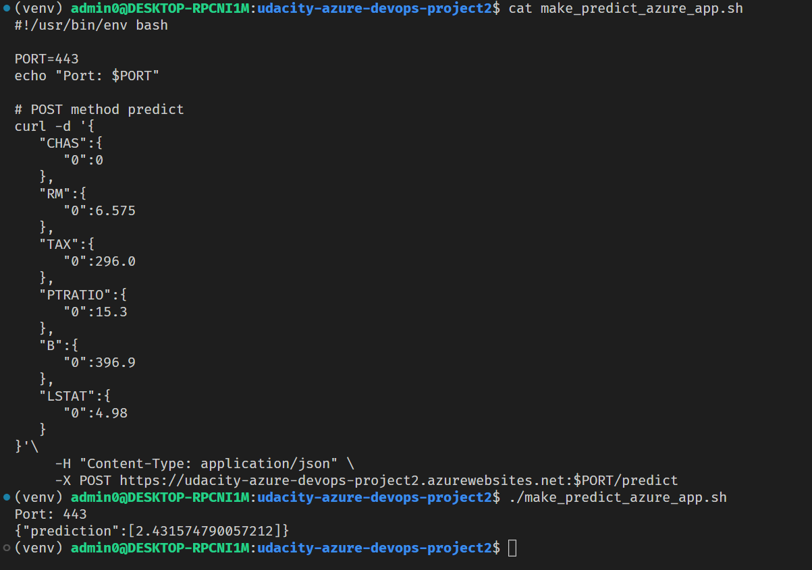

# Overview
This is a Python-based machine learning project deployed on Azure Web App service and using Flask web-framework as it rest-API. The machine learning model will predict the price of Boston houses according to some information such as average room in the house, data about highway access and so on.

## Project Plan
- [Project plan](https://docs.google.com/spreadsheets/d/1lS0_nD0a2gimpy0jQcHxFSqQ9Rm3pjqQlrCMkl8MxZY/edit?usp=sharing)
- [Trello](https://trello.com/invite/b/tJXvs7Jm/ATTId37511caf76a188e3e1ba8704824dee5C3B3ADE2/udacity-azure-devops-project2)

## Instructions


* Project running on Azure App Service
```
    az webapp up --sku F1 -n <web_app_name> -g <azure-resoure-group>
```


* Project cloned into Azure Cloud Shell


* Passing tests that are displayed after running the `make all` command from the `Makefile`


* Output of a test run


* Successful deploy of the project in Azure Pipelines.  [Note the official documentation should be referred to and double checked as you setup CI/CD](https://docs.microsoft.com/en-us/azure/devops/pipelines/ecosystems/python-webapp?view=azure-devops).

    

* Running Azure App Service from Azure Pipelines automatic deployment


* Successful prediction from deployed flask app in Azure Cloud Shell.  [Use this file as a template for the deployed prediction](https://github.com/udacity/nd082-Azure-Cloud-DevOps-Starter-Code/blob/master/C2-AgileDevelopmentwithAzure/project/starter_files/flask-sklearn/make_predict_azure_app.sh).
The output should look similar to this:


* Output of streamed log files from deployed application


* Locust


## Enhancements
- Deploy infrastructure using provisioning tool like Terraform
- Deploy the application on Kubernetes cluster
- Apply rolling update 
- Adding more test/case to the application.


## Demo 
Youtube: https://www.youtube.com/watch?v=n2PNlUqwNtg